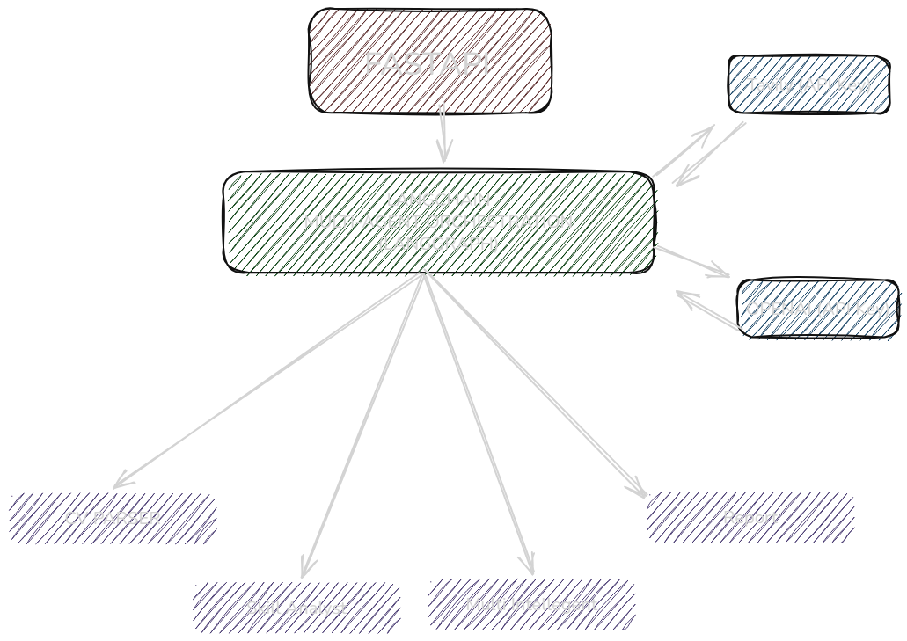

# 🌱 SPROUT  
**Smart Processing for Resume, Opportunities, and Unique Talent**

SPROUT is an **AI-powered multi-agent system** that streamlines the recruitment process by transforming raw CVs into actionable insights.  
It is designed to augment recruiters with **structured parsing, skill analysis, market intelligence, and personalized reports**.

---

## 🎥 Demo
[▶️ Play Demo Video](docs/demo.mp4)

---

## 🏗️ System Architecture
gh-dark-mode-only)


**Flow:**
1. **Frontend (HTML/JS)** → Upload CV + target role.  
2. **FastAPI Backend** → API gateway & routes.  
3. **Multi-Agent Orchestration (LangGraph)** → coordinates agents:  
   - CV Parser Agent  
   - Skill Analyst Agent  
   - Market Intelligence Agent  
   - Report Agent  
4. **Output** → Structured JSON + Markdown report (rendered in UI).  

---

## 🔍 Features (Assessment Mapping)

### 1. CV Parsing & Normalization Agent
- **Role:** The "Data Engineer".  
- **Task:** Ingest raw CV (PDF, DOCX, TXT) → structured JSON.  
- **Model:** `gpt-4o-mini` (OpenAI) via LangChain → chosen for **robust extraction & JSON reliability**.  
- **Frameworks:**  
  - `LangChain` → Prompt chaining.  
  - `PyPDF2`, `python-docx` → Text extraction.  
- **Output:** JSON fields (name, email, phone, education, experience, skills, projects).  

### 2. Specialized Skill Analyst Agent
- **Role:** The "Subject Matter Expert".  
- **Task:** Enrich CV with explicit, implicit, and transferable skills.  
- **Model:** `gpt-4o-mini` → balances cost, speed, and quality inference.  
- **Why:** Powerful enough to infer skills from context & projects.  
- **Output:** JSON with categorized skills and reasoning.  

### 3. Market Intelligence Agent
- **Role:** The "Market Researcher".  
- **Task:** Query live market/job data for role demands.  
- **Tool:** [Tavily API](https://tavily.com) → real-time web search.  
- **Why:** Free-tier, easy integration, reliable for skill demand queries.  
- **Output:** JSON with in-demand skills and summarized market trends.  

### 4. Recommendation & Report Agent
- **Role:** The "Strategist & Communicator".  
- **Task:** Synthesize outputs from Agents 2 + 3 into a professional Markdown report.  
- **Model:** `gpt-4o-mini`.  
- **Why:** Generates clean, structured Markdown consistently.  
- **Output:** Markdown with:  
  1. Candidate Summary 👤  
  2. Skill Analysis 🧩  
  3. Market Analysis 📈  
  4. Skill Gap ⚖️  
  5. Upskilling Plan 🚀  

### 5. Multi-Agent Orchestration
- **Framework:** `LangGraph` (state machine orchestration).  
- **Why:** Explicitly models dependencies → ensures agents run in correct order.  
- **Flow:** Parser → Skill Analyst → Market Intel → Report.  
- **Output:** End-to-end report pipeline from raw CV to final recommendation.  

---

## ⚙️ Tech Stack
- **FastAPI** → REST API framework.  
- **LangChain + LangGraph** → Agent orchestration & LLM integration.  
- **OpenAI (gpt-4o-mini)** → Default LLM for CV parsing & report generation.  
- **Tavily API** → External search tool for job market intelligence.  
- **Pydantic** → Schema validation.  
- **pytest + httpx** → Unit & integration testing.  
- **Frontend** → Minimal HTML/JS with Markdown rendering.  

---

## ▶️ Running the Application

### 1. Install dependencies
```bash
poetry install
```

### 2. Set environment variables
```bash
export OPENAI_API_KEY=your_openai_key
export TAVILY_API_KEY=your_tavily_key
```

### 3. Run FastAPI server
```bash
uvicorn app.main:app --reload
```

### 4. Open frontend
Go to:  
👉 [http://127.0.0.1:8000](http://127.0.0.1:8000)  

- Upload CV (PDF/DOCX/TXT).  
- Enter **Target Role**.  
- Click **Analyze** → View structured report in Markdown.  
- Download report as `.md` or `.pdf`.  

---

## 🐳 Running with Docker

You can also run SPROUT inside a Docker container.

### 1. Build the image
```docker build -t sprout .```

### 2. Run the container
Using environment variables:
```bash
docker run -it --rm -p 8000:8000 \
  -e OPENAI_API_KEY=your_openai_key \
  -e TAVILY_API_KEY=your_tavily_key \
  sprout
```

Or using an `.env` file:
1. Create a file named `.env`:
  ```bash
  OPENAI_API_KEY=your_openai_key
  TAVILY_API_KEY=your_tavily_key
  ```

2. Run with:
  ```docker run -it --rm -p 8000:8000 --env-file .env sprout```

### 3. Access the app
Go to:
👉 [http://127.0.0.1:8000](http://127.0.0.1:8000)

Here you can upload a CV file and test the full multi-agent pipeline.


## 🧪 Testing
Run all tests with:

```bash
pytest -v
```

Covers:  
- CV Parser Agent (pdf, docx, txt).  
- Skill Analyst Agent.  
- Market Intelligence Agent.  
- Report Agent.  
- Pipeline orchestration (end-to-end).  

---

## 📝 Example Output (Markdown)

```markdown
# 📄 Candidate Report

## 👤 Candidate Summary
- **Name:** John Doe
- **Email:** john.doe@example.com
- **Skills:** Python, SQL, Apache Spark, Airflow, AWS

## 🧩 Skill Analysis
- Explicit: Python, SQL, Spark
- Implicit: ETL, Cloud Architecture
- Transferable: Problem-Solving, Collaboration

## 📈 Market Analysis (AI Engineer)
- In-demand: Python, ML, Deep Learning, MLOps
- Summary: Market expects strong ML + cloud expertise.

## ⚖️ Skill Gap
- Missing: TensorFlow, PyTorch, MLOps
- Strengths: Python, Data Engineering

## 🚀 Upskilling Plan
1. Learn Deep Learning (TensorFlow, PyTorch).  
2. Study MLOps (MLflow, Kubeflow).  
3. Build real-world ML projects.  
```

---

## ✅ Why This Setup?
- **OpenAI GPT-4o-mini** → best tradeoff (cost, speed, accuracy).  
- **LangChain & LangGraph** → clean orchestration of multi-agent workflow.  
- **Tavily API** → ensures real-world, live skill demand search.  
- **FastAPI + Pydantic** → robust backend with validated responses.  
- **Testing** → unit & integration with mocked API calls.  
- **Frontend** → lightweight, modern, Markdown-friendly UI.  

---

✨ With SPROUT, recruiters can go beyond keyword-matching → they get a **structured skill-gap analysis & personalized roadmap** in just a few clicks.
